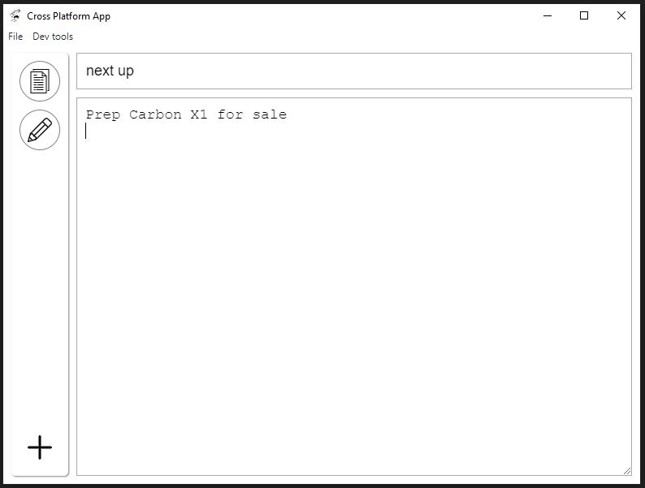

04/29/2023

2:34 PM

this is not insanity... lol keep reproducing things

it's a calendar I guess... I mean for me second brain, cliche saying

You can see below a notepad I use... I sold my RM2 (sad) I would use that too... BUT it was not synced

Before I sold it I did export the almost 400 pages of drawings/scribbles I had.

This is an app I never finished... I did the base parts where it's cross platform via ElectronJS wrapper and a noob RN/Android widget companion apps.

That's the idea though... it's for the most part a shared API with different clients, now including the AR monocle... although that's limited (waiting on updated firmware).

I probably won't touch this for a bit... there are other things I'm going to make.

But... if I don't touch this for a while I'll make it private like other projects that went nowhere.
